# Exploratoray_Data_Analysis
This project involves hi a comprehensive Exploratory Data Analysis (EDA) on a hospital dataset to uncover insights related to patient demographics, hospital stay durations, diagnoses, treatment outcomes, and other healthcare-related variables. The goal is to identify patterns, anomalies, and trends that could assist in improving healthcare.

# 🏥 Hospital Inpatient Characteristics Analysis

This project explores inpatient hospitalization data across U.S. counties by sex and geography. Using Python-based data visualization, we uncover insights into healthcare demographics and disparities.

---

## 📁 Dataset Overview

The dataset includes:
- Sex of patients (Male/Female)
- County of residence
- Number of inpatient discharges

---

## 🛠️ Tools Used

- Python
- Pandas
- Matplotlib
- Seaborn
- Jupyter Notebook
- Visual Studio Code

---

## 📊 Sample Visualizations

| Chart | Description |
|-------|-------------|
| 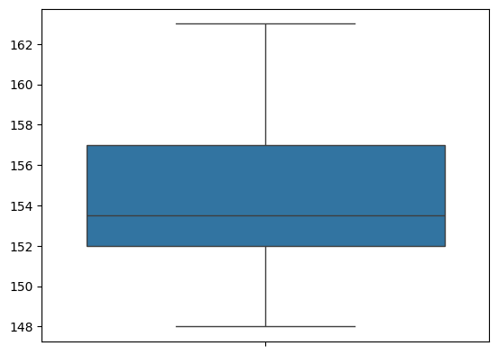 | **dsch_yr value count** |
| 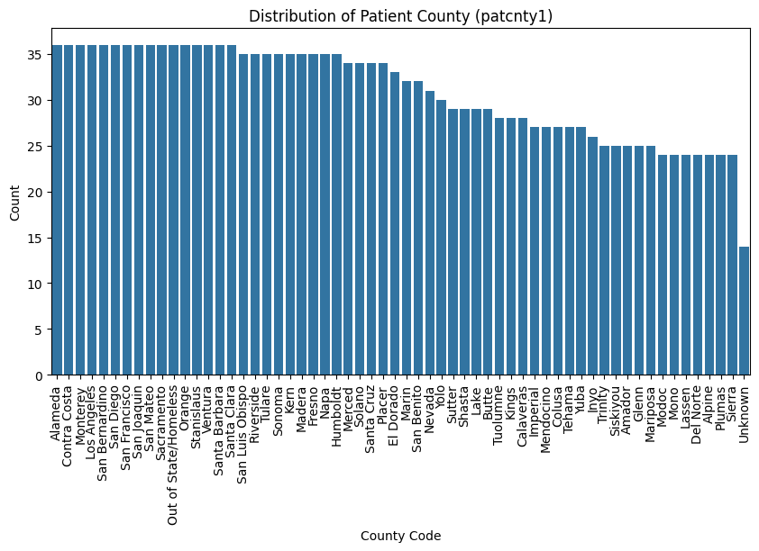 | **Distribution Of Patient County (patcnty1)** |
| 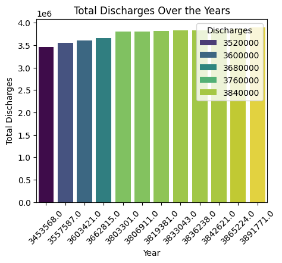 | **Total Discharges Over the Years** |
| 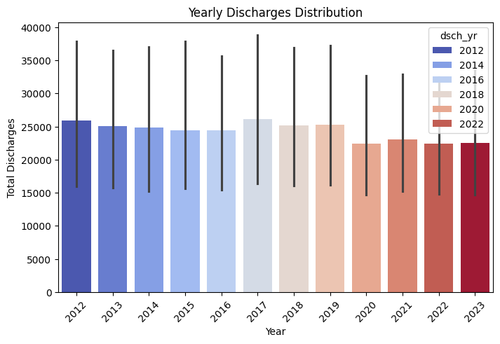 | **Yearly Discharges Distribution** |
| 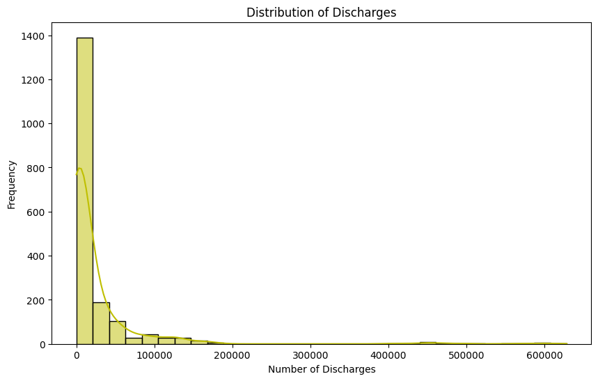 | **Distribution of Discharges** |
| 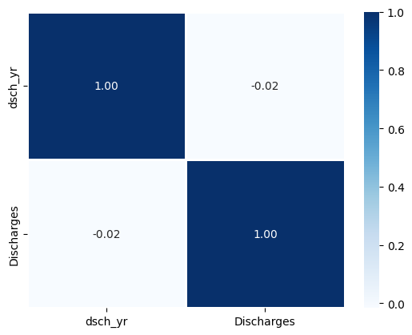 | **discharge dsch_yr Heatmap** |
| 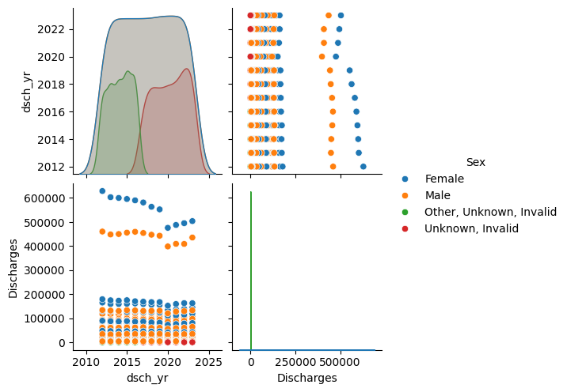 | **discharge dsch_yr Pairplot** |
| 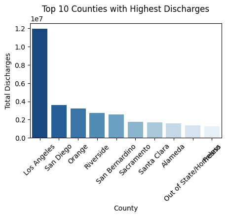 | **Top 10 Counties With Highest Discharges** |
| 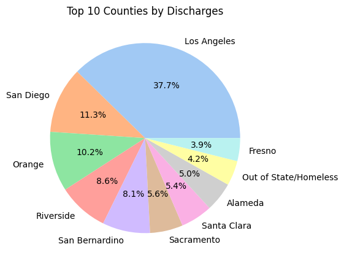 | **Top 10 Counties By Discharges** |
| 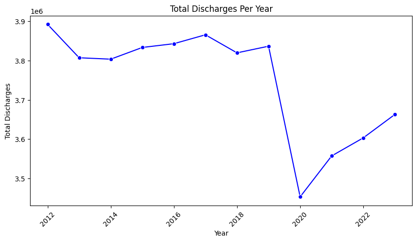 | **Total Dischages Per Year** |
| 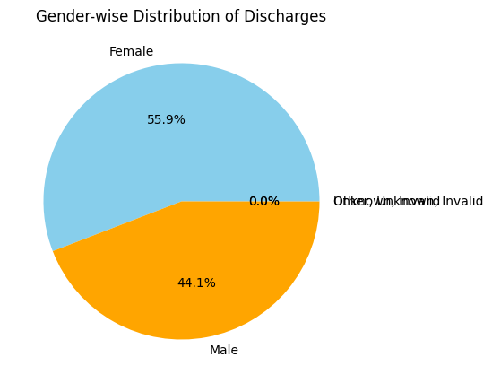 | **Gender-wise Distribution Of Discharges** |
| 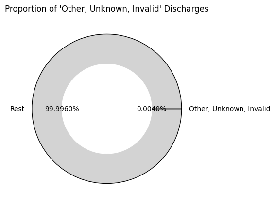 | **Proportion of 'Other, Unknown, Invalid' Discharges** |

> 📌 All charts generated in `Hospital_Analysis.ipynb`

---

## 🚀 How to Run

1. Clone the repo:
   ```bash
   git clone https://github.com/yourusername/Exploratoray_Data_Analysis.git
   cd Exploratoray_Data_Analysis
